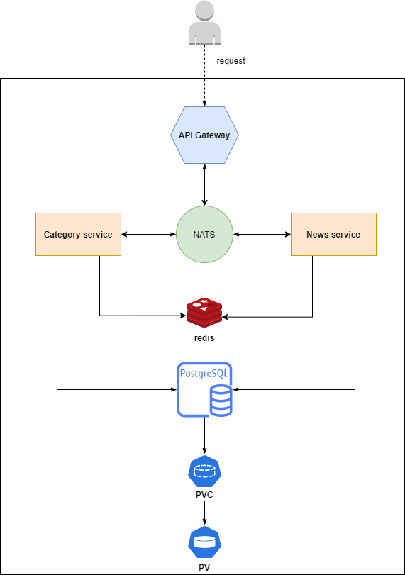

# 1. Introduction about system

Regarding the system, we will use Nodejs Molecular, this is a framework used to build applications with Microservices architecture.

`API Gateway`: acts as the application's input, it will create an HTTP Endpoint and receive requests from users.

`NATS`: acts as a relay station for services to communicate with each other.

`Categories Service and News Service`: this is a Service that does CRUD work for related resources.

`Redis`: used to cache the results retrieved from the Database, helping to reduce the number of times to execute queries to the DB and increase the speed of the application.

`Database`: where data is stored, we will use PostgreSQL.

